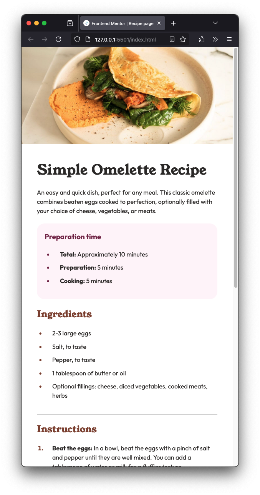

# Frontend Mentor - Recipe page solution

This is a solution to the [Recipe page challenge on Frontend Mentor](https://www.frontendmentor.io/challenges/recipe-page-KiTsR8QQKm). Frontend Mentor challenges help you improve your coding skills by building realistic projects. 

## Table of contents

- [Overview](#overview)
  - [The challenge](#the-challenge)
  - [Screenshot](#screenshot)
  - [Links](#links)
- [My process](#my-process)
  - [Built with](#built-with)
  - [What I learned](#what-i-learned)
  - [Continued development](#continued-development)
  - [Useful resources](#useful-resources)
- [Author](#author)
- [Acknowledgments](#acknowledgments)

## Overview

### Screenshot



### Links

- [Solution URL](https://github.com/larsb-dev/recipe-page)
- [Live Site URL](https://larsb-dev.github.io/recipe-page/)

## My process

### Built with

- Semantic HTML5 markup
- CSS custom properties
- Mobile-first workflow

### What I learned

I hadn't used HTML tables in a while, so it took me some time to get used to their behavior again.
To style all the table rows except the last one with a bottom border, I used this selector:

```css
.nutritional-info tr:not(:last-child) {
  border-bottom: 1px solid var(--color-stone-150);
}
```

I learned that `:not()` pseudo-class itself does not add specificity, but the selectors inside it do.

I also find it more challenging to build something without a Figma file - it makes me less comfortable when there’s no visual reference to guide the design.

### Continued development

Get a bit better every day which compounded over time leads to massive improvement.

### Useful resources

- [Recipe Page Built with HTML & CSS (Mobile-First Approach)](https://www.frontendmentor.io/solutions/recipe-page-built-with-html-and-css-mobile-first-approach-Z01_cLadSL) - Took a look at her solution, mainly how to style the section with the table.

## Author

- Frontend Mentor - [@yourusername](https://www.frontendmentor.io/profile/larsb-dev)
